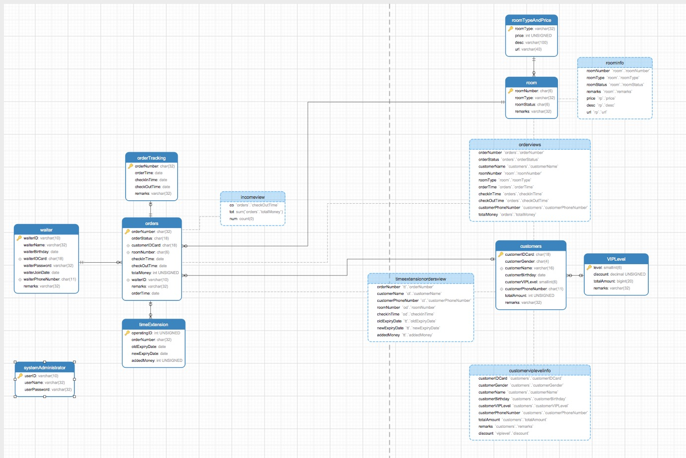

## 项目简介
- 数据库课程设计，基于MySQL + Tomcat + IDEA + JSP + Servlet开发
- 前端框架采用Semantic UI + ECharts.js
- 关于项目的具体信息，请访问[这里](http://chironyf.com/2018/01/11/hotel-management-system-summary/)

## 运行
1. 在MySQL中建立一个名为hmsn的数据库（别的名字也行，但需要在项目的GCON中修改一下URL）
2. 执行hotelCreateDB.sql，后面创建用户的语句需要单独执行
3. 执行hotelCreateData.sql
4. 将项目部署到Tomcat即可

## 项目成员
- [chironyf](https://github.com/chironyf)(数据可视化展示、添加房间、订单管理等)
- [李轩](https://github.com/994047477)(订房退房、续费、房间查询预览等)
- [ZoeQ](https://github.com/ZoeQ)(员工编辑、添加等)

## 关系模型

## 项目截图（更多图片见images文件夹）
- 登录界面

- 宾馆员工树图

- 客房查询

- 业务数据可视化展示

- 订单管理

